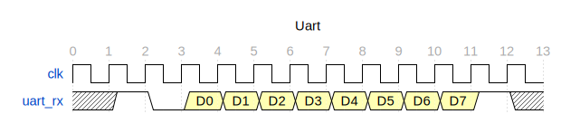

# UART Core Module

- [UART Core Module](#uart-core-module)
  - [Introduction](#introduction)
  - [UART Timing](#uart-timing)
  - [uart\_baud.sv](#uart_baudsv)
    - [Ports](#ports)
    - [Implementation](#implementation)
  - [uart\_rx.sv](#uart_rxsv)
    - [Ports](#ports-1)
    - [Implementation](#implementation-1)
  - [uart\_tx.sv](#uart_txsv)
    - [Ports](#ports-2)
    - [Implementation](#implementation-2)


## Introduction

The UART core modules contains 4 RTL files:

| File             | Description                                 |
| ---------------- | ------------------------------------------- |
| **uart_baud.sv** | Generate sample tick for a given baud rate. |
| **uart_tx.sv**   | UART transmit module.                       |
| **uart_rx.sv**   | UART receive module.                        |
| **uart_core.sv** | Instantiate uart_tx and uart_rx             |

## UART Timing

Here is an example of UART Transaction with 0 parity bit and 1 stop bit.




## uart_baud.sv

### Ports

| Name               | Direction | Width | Description                                                    |
| ------------------ | --------- | ----- | -------------------------------------------------------------- |
| `clk`              | Input     | 1     | System clock.                                                  |
| `rst_b`            | Input     | 1     | Active-low synchronous reset.                                  |
| `cfg_div`          | Input     | 16    | Baud rate clock divider. See formula below for calculation.    |
| `baud_clear`       | Input     | 1     | Resets the baud counter and starts a new sampling sequence.    |
| `baud_sample_6th`  | Output    | 1     | Asserted at the 6th tick of a 16x oversampling cycle.          |
| `baud_sample_8th`  | Output    | 1     | Asserted at the 8th tick of a 16x oversampling cycle.          |
| `baud_sample_10th` | Output    | 1     | Asserted at the 10th tick of a 16x oversampling cycle.         |
| `baud_sample_16th` | Output    | 1     | Asserted at the 16th (final) tick of a 16x oversampling cycle. |


### Implementation

This module is responsible for generating timing tick for uart_tx and uart_rx module base on configurable baud rate.
This uart design uses 16x oversampling to improve reliability. As such, this module generates 16 ticks per baud period,
with specific output signals marking the 6th, 8th, 10th, and 16th ticks.

To support a wide range of baud rates and clock frequencies, the module accepts a configurable divider input `cfg_div`
which defines the number of clock cycles between each baud tick.

To determine the correct value for **cfg_div**, use the following equation:

```ini
cfg_div = (clock_frequency (ns) / baud_rate) - 1
```

Example `cfg_div`:

| Clock Frequency | Baud Rate | `cfg_div` Value |
| --------------- | --------- | --------------- |
| 100 MHz         | 115200    | **867**         |
| 50 MHz          | 115200    | **433**         |
| 25 MHz          | 115200    | **216**         |

> ⚠️ **Note**: Because the design use 16x oversampling, it lose some precision on the cfg_div when it perform integer division: `cfg_div / 16`. If the clock frequency is too low (`< 50MHz`), the UART controller may not able to operate correctly.

## uart_rx.sv

### Ports

| Name        | Direction | Width | Description                                               |
| ----------- | --------- | ----- | --------------------------------------------------------- |
| `clk`       | Input     | 1     | System clock.                                             |
| `rst_b`     | Input     | 1     | Active-low synchronous reset.                             |
| `cfg_div`   | Input     | 16    | Clock divider counter. Shared with `uart_baud` module.    |
| `cfg_rxen`  | Input     | 1     | RX enable signal. Enables UART receive logic.             |
| `cfg_nstop` | Input     | 1     | Number of stop bits. `0` = 1 stop bit, `1` = 2 stop bits. |
| `uart_rxd`  | Input     | 1     | UART receive data line.                                   |
| `rx_valid`  | Output    | 1     | Indicates that received data is valid.                    |
| `rx_data`   | Output    | 8     | Received data byte.                                       |

### Implementation

#### 16x Rx oversampling and 2/3 majority voting

To mitigate noise on the uart_rxd input line, this UART receiver uses 16x oversampling combined with 2/3 majority voting per bit.

Each UART bit period is divided into 16 sampling ticks. The receiver samples the uart_rxd signal three times at the
6th, 8th, and 10th oversampling ticks. The majority value among these three samples is taken as the final value for that bit.

#### RX state machine


| State   | Description                                 |
| ------- | ------------------------------------------- |
| `IDLE`  | Waiting for the start bit (line idle/high). |
| `START` | Sampling the start bit.                     |
| `DATA`  | Receiving data bits.                        |
| `STOP`  | Receiving stop bit(s).                      |


## uart_tx.sv

### Ports

| Name        | Direction | Width | Description                                               |
| ----------- | --------- | ----- | --------------------------------------------------------- |
| `clk`       | Input     | 1     | System clock.                                             |
| `rst_b`     | Input     | 1     | Active-low synchronous reset.                             |
| `cfg_div`   | Input     | 16    | Clock divider counter, shared with `uart_baud` module.    |
| `cfg_txen`  | Input     | 1     | TX enable signal. Enables UART transmit logic.            |
| `cfg_nstop` | Input     | 1     | Number of stop bits: `0` = 1 stop bit, `1` = 2 stop bits. |
| `tx_valid`  | Input     | 1     | Indicates valid TX data is available.                     |
| `tx_data`   | Input     | 8     | Data byte to transmit.                                    |
| `tx_ready`  | Output    | 1     | Indicates transmitter is ready to accept new data.        |
| `uart_txd`  | Output    | 1     | UART transmit data line.                                  |

### Implementation

#### TX state machine


| State   | Description                                    |
| ------- | ---------------------------------------------- |
| `IDLE`  | Waiting for new transmit request (`tx_valid`). |
| `START` | Sending start bit (logic low).                 |
| `DATA`  | Transmitting data bits (LSB first).            |
| `STOP`  | Sending stop bit(s) (logic high).              |
